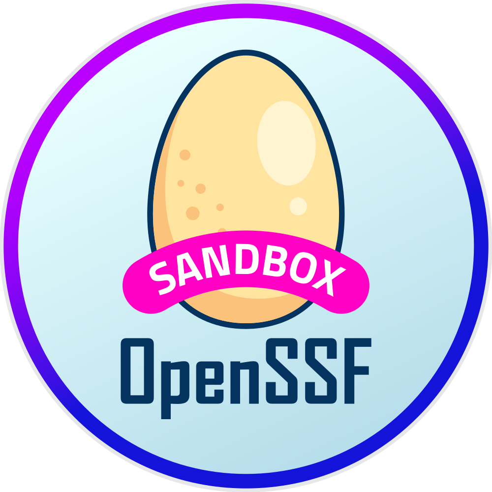

__bomctl__ is format-agnostic Software Bill of Materials (SBOM) tooling, which is intended to bridge the gap between SBOM generation and SBOM analysis tools. It focuses on supporting more complex SBOM operations on multiple SBOM files that represent systems by being opinionated on only supporting the [NTIA minimum fields](https://www.ntia.doc.gov/files/ntia/publications/sbom_minimum_elements_report.pdf) or other fields supported by [protobom](https://github.com/protobom/protobom).

- [Try `bomctl` in our gitpod playground](https://gitpod.io/?autostart=true#https://github.com/bomctl/bomctl-playground)

> [!NOTE]
> This is an experimental project under active development. We'd love feedback on the concept, scope, and architecture!

## Features

- Work with multiple SBOMs in tree structures (through external references)
- Fetch and push SBOMs using multiple protocols
- Leverage a `.netrc` file to handle authentication
- Manage SBOMs using a persistent database cache
- __FUTURE__ - Manipulate SBOMs with commands like `diff`, `split`, and `redact`
- __FUTURE__ - Interface with OpenSSF projects and services like [GUAC](https://guac.sh/) and [Sigstore](https://www.sigstore.dev/)

## Join our Community

- [#bomctl on OpenSSF Slack](https://openssf.slack.com/archives/C06ED5VB81W)
- [OpenSSF Security Tooling Working Group Meeting](https://zoom-lfx.platform.linuxfoundation.org/meeting/94897563315?password=7f03d8e7-7bc9-454e-95bd-6e1e09cb3b0b) - Every other Friday at 8am Pacific
- [SBOM Tooling Working Meeting](https://zoom-lfx.platform.linuxfoundation.org/meeting/92103679564?password=c351279a-5cec-44a4-ab5b-e4342da0e43f) - Every Monday at 2pm Pacific
